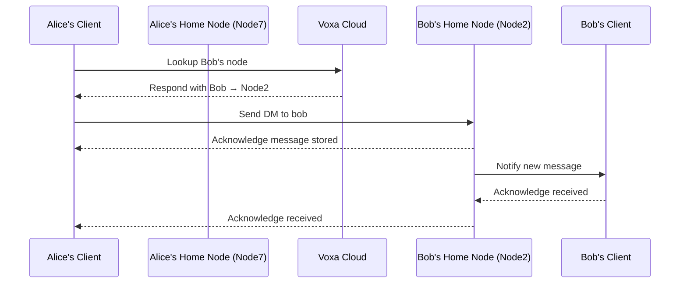

# Protocol

## DM structure

The Direct-Message structure works like Email, but real-time and the node uses a temporary auth, a node is what stores messages that are sent by a user.

```mermaid
sequenceDiagram
    participant AliceClient as Alice's Client
    participant AliceNode as Alice's Home Node (Node7)
    participant Voxa as Voxa Cloud
    participant BobNode as Bob's Home Node (Node2)
    participant BobClient as Bob's Client

    AliceClient->>Voxa: Lookup Bob's node
    Voxa-->>AliceClient: Respond with Bob → Node2
    AliceClient->>BobNode: Send DM to bob
    BobNode-->>AliceClient: Acknowledge message stored
    BobNode->>BobClient: Notify new message
    BobClient-->>BobNode: Acknowledge received
    BobNode-->>AliceClient: Acknowledge received
```
