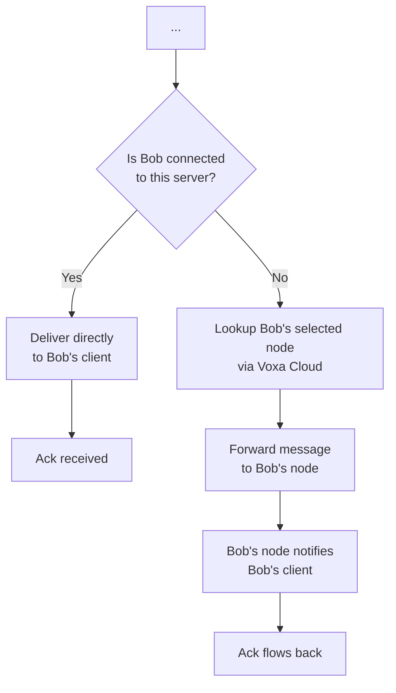
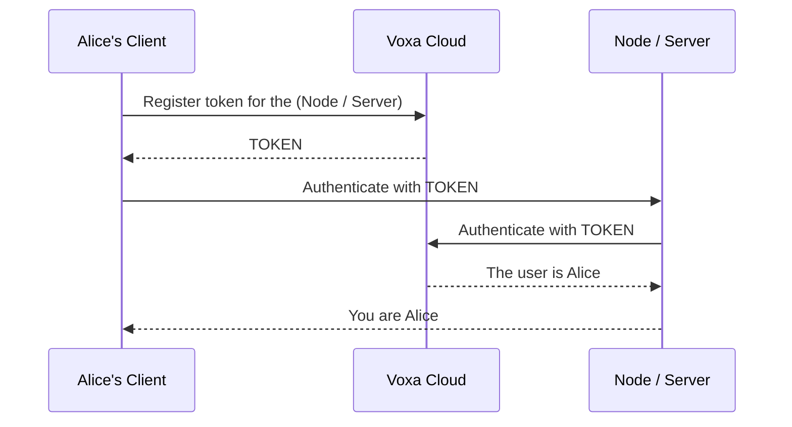

## Setup
### Requirements
- Node.Js with npm
- Postgres DB

```python
DB_USER= # Usually related to the OS username but do your own research
DB_HOST=localhost
DB_PASSWORD= # Can be empty
DB_PORT=5432 # Optional
```


## Keywords

- Voxa Client: The user-side app which communicates with all below.
- Voxa Cloud: The authentication and user management handler.
- Voxa Server: The self-host-able community/friends communication service.
- Voxa Node: The self-host-able Private Message communication service, also used for sending notifications.

## Node Structure

The Direct-Message structure works like Email, but real-time and the node uses a temporary auth, a node is what stores messages that are sent by a user.

This diagram shows that in order to send a message to a user, you must connect to their chosen node, which can be accessed via the Voxa Cloud and connected to directly.

A node message can be a DM (Direct Message between two parties), or a SM (Server Message from a community).

```mermaid
sequenceDiagram
    participant AliceClient as Alice's Client
    participant Voxa as Voxa Cloud
    participant BobNode as Bob's Selected Node (Node2)
    participant BobClient as Bob's Client

    AliceClient->>Voxa: Lookup Bob's node
    Voxa-->>AliceClient: Respond with Bob → Node2
    AliceClient->>BobNode: Authenticate and Send DM to bob
    BobNode-->>AliceClient: Acknowledge message stored
    BobNode->>BobClient: Notify new message
    BobClient-->>BobNode: Acknowledge received
    BobNode-->>AliceClient: Acknowledge received
```



## Server Structure

Let's say Alice sends a message in `general`, this is how the server handles it



## Authentication handshake

This sequence happens when you connect to a server or node.



### Edge cases:

<details>
<summary>The server doesn't send the user id (or the proper user ID) to the client</summary>

1. The server is compromised / has evil intents
2. The token is compromised / client has evil intents

</details>

<details>
<summary>The client or server fail to handle the protocol or handshake</summary>

1. The server is likely outdated and lacks maintenance
2. The client is likely outdated and lacks maintenance

</details>

All of these edge cases don't have the fact written, but each edge case can be induced by a bug or 3rd party not necessarily implicating evil intents.
